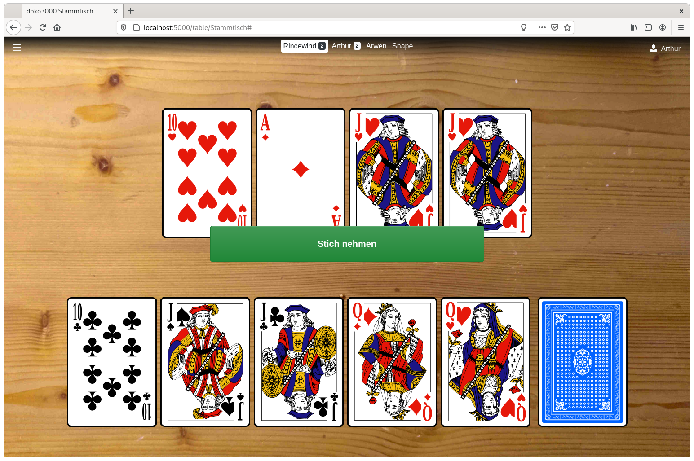
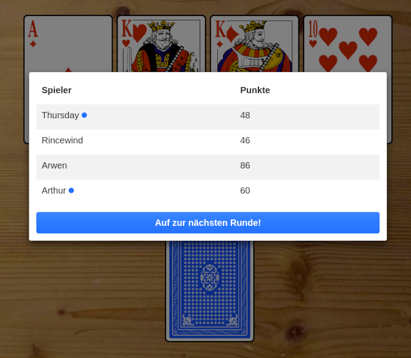
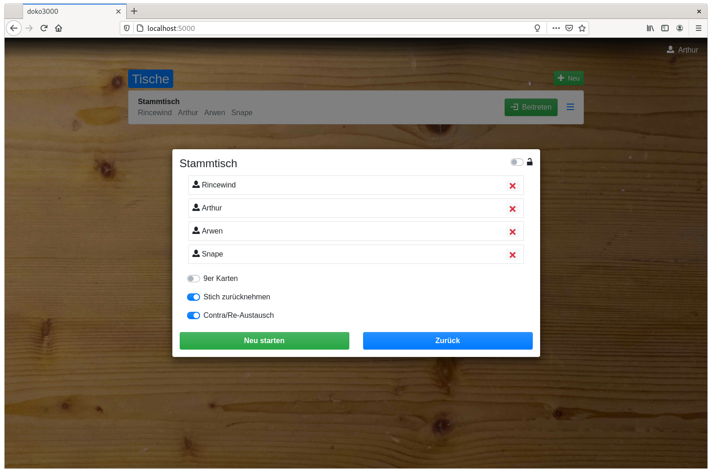

# doko3000

Simple Doppelkopf deck simulation via web browser

## Overview

The 2020 coronavirus pandemic spring lockdown forced us to move our Doppelkopf gatherings from real world to online.
Doko3000 helps to keep the ongoing league competition going.

It just provides a **virtual table** with **virtual cards**. Players play like in the real world, preferably talking to each
other via video conference in a parallel window.
To keep as much normality during the pandemic, doko3000 is intended to be **as digital as necessary, as analog as possible**.
This is why **no rules** are included, because there are so many and players should apply them like sitting at a real table.
For the same reason there are **no scoreboards** or statistics - it will even feel more familiar if somebody of the group
notes the score as before.

Ingame language at the moment is only german due to Doppelkopf being a mostly german phenomenon. Might change in the future.

## Screenshots

Player sees cards in its hand and the ones on the table. The display at the top shows all 4 players of the current round:

A big green button appears when there is a trick to claim:

After the round was finished the achieved score of the players is shown:

The table settings allow to arrange players and enable some options:

## Installation

Doko3000 is a [Python](https://python.org) web application based on:

 - [Flask](https://flask.palletsprojects.com),
 - [Flask-SocketIO](https://flask-socketio.readthedocs.io) and
 - [CouchDB](https://couchdb.apache.org/).
 
 As **server** anything capable of running Python might work, but best experiences were made with **containers** on Linux.
 
 As **client** any current browser will do, as long as it can make use of WebSocket, which is
  necessary for the game communication.
 
  ### Environment file
 
 The file [default.env](./docker/default.env) can be copied to **.env**, wherever **docker-compose** is intended to be run.
 Inside the environment file you could set optional variables:
 
 - **HOST** = *localhost* - name of the server host to be used at least as *cors_allowed_origins* in flask
 - **SECRET_KEY** = *change_me* - secret key for flask sessions
 - **COUCHDB_USER** = *admin* - CouchDB user used by doko3000 and couchdb containers
 - **COUCHDB_PASSWORD** = *doko3000* - CouchDB password used by doko3000 and couchdb containers
 
 
 *To be continued...*