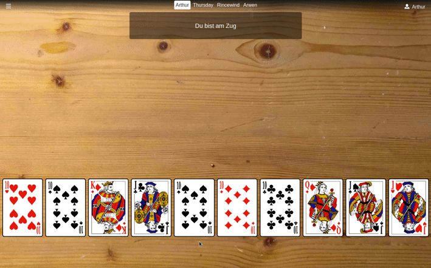
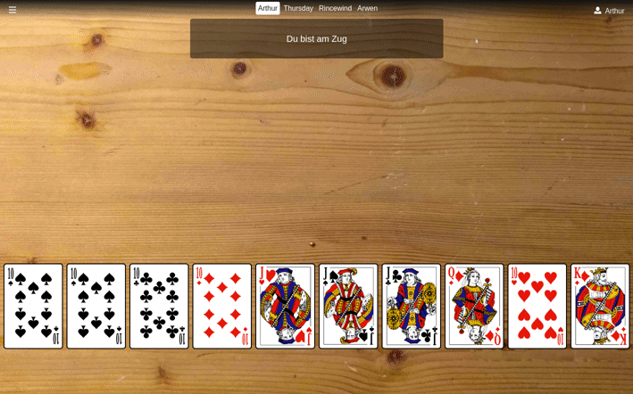
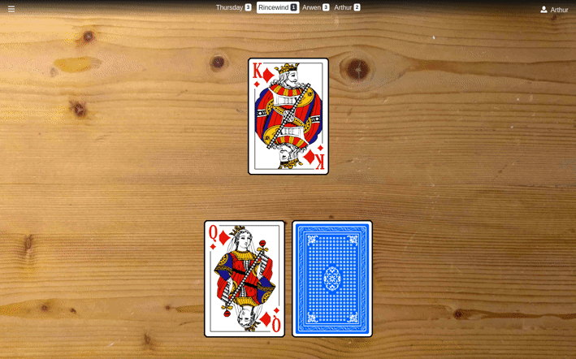
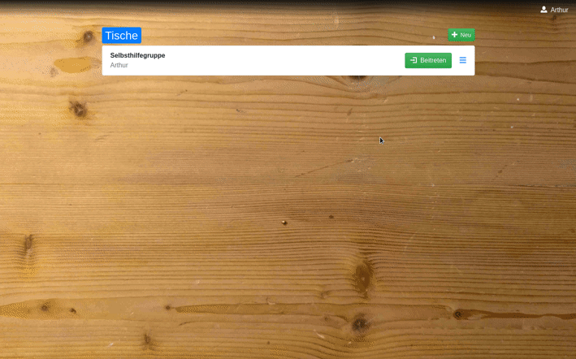
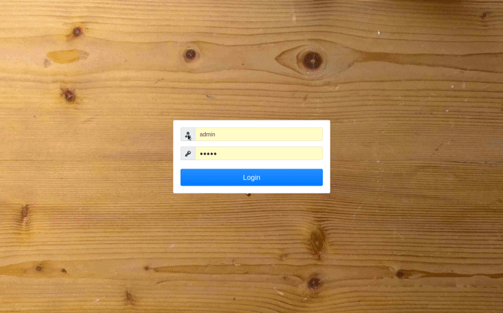

# doko3000

Simple Doppelkopf card deck simulation web service.

## Overview

The 2020 coronavirus pandemic spring lockdown forced us to move our Doppelkopf gatherings from real world to online.
Doko3000 helps to keep the ongoing league competition going.

It just provides a **virtual table** with **virtual cards**. Players play like in the real world, preferably talking to each
other via video conference in a parallel window.
To preserve as much normality during the pandemic as possible, doko3000 is intended to be **as digital as necessary, as analog as possible**.
This is why **no rules** are included, because there are so many and players should apply them like sitting at a real table.
This means **absolute freedom** to play with **all custom rules** players are used to play.

For the same reason there are **no global scoreboards** or statistics - it will even feel more familiar if somebody of the group
notes the score as before.

Doko3000 runs on a **web server** and is accessed by the players via **web browser**.

Ingame language at the moment is only german due to Doppelkopf being a mostly german phenomenon. Might change in the future.

## Gameplay

Most likely every game starts with **sorting cards**:

After all players had their turns it's time to **claim** the **trick**:

The last trick **finishes** the current round and makes the **score** appear:

## Management

The `admin` user has the right to **create new players**, which themselves can be **administrators too**.

Every player is able to **create new tables** via the nice **green** `Neu` **button**.

Players can enter a table by clicking the **green** `Beitreten` **button** in the table's row:

If **at least 4 players** entered a table a round may begin. Configure it via the `Einstellungen` in the **hamburger 
menu** at the upper left. The **order** of the players may be changed by **drag & drop**. As always the first
player is dealing and the second will be the first to play. Run it via `Neu starten` **button**:

## Installation

Doko3000 is a [Python](https://python.org) web application mostly based on:

 - [Flask](https://flask.palletsprojects.com)
 - [Flask-SocketIO](https://flask-socketio.readthedocs.io)
 - [CouchDB](https://couchdb.apache.org/)
 - [SVG-Cards](http://svg-cards.sourceforge.net/)
 - [Dragula](https://bevacqua.github.io/dragula/)
 - [Bootstrap](https://getbootstrap.com)
 - [jQuery](https://jquery.com)
 - [Open Iconic](https://useiconic.com/open)
 
As **server** anything capable of running Python might work, but best experiences were made with **containers** on Linux.
 
As **client** any current browser will do, as long as it can make use of **WebSocket**, which is
necessary for the game communication.
 
### Getting doko3000
 
At the moment it is only available from Github:
 
    git clone https://github.com/HenriWahl/doko3000.git
 
All further steps are based on the `doko3000` directory:
 
    cd doko3000
     
### Environment file .env
 
Inside the environment file some variables could be set:
 
- **HOST** - name of the server host to be used at least as *cors_allowed_origins* in flask
- **COUCHDB_URL** - URL of CouchDB server
- **COUCHDB_DATABASE** - name of database on server
- **COUCHDB_USER** - CouchDB user used by containers doko3000 and couchdb
- **COUCHDB_PASSWORD** - CouchDB password used by containers doko3000 and couchdb
- **SECRET_KEY** - secret key for flask sessions
- **DEBUG** - enable Flask-Socketio debugging

The example file [/docker/default.env](./docker/default.env) can be copied to `.env` wherever
**docker-compose** is intended to be run:
 
    cp docker/default.env .env
 
The default settings should already work - only **COUCHDB_USER** and **COUCHDB_PASSWORD** have to be set at least once
to initialize the CouchDB database in the `doko3000-couchdb` container.

###  Running the server with docker-compose.yml
  
In `./docker` there are 3 example **docker-compose** configuration files. Just run one of them from the root 
directory you're in.

The simplest way is running it only accessible via HTTP on port 80:
  
    docker-compose -f docker/docker-compose.yml up -d
  
If you plan to use HTTPS better use the *docker-compose-https.yml* file. Copy the **certificate** and **key** files
respectively as *cert.pem* and *key.pem* into [/docker](./docker) and run:
  
    docker-compose -f docker/docker-compose-https.yml up -d
    
The third file *docker-compose-https-letsencrypt.yml* can be used for Let's Encrypt setups and is based on 
[Nginx and Let’s Encrypt with Docker in Less Than 5 Minutes](https://medium.com/@pentacent/nginx-and-lets-encrypt-with-docker-in-less-than-5-minutes-b4b8a60d3a71) -
maybe there is a more elegant way but it works fine here. This docker-compose configuration surely has to be customized.

### Et voilà!

If you run it on your local machine, point your favorite browser to http://localhost and you will find the login page:
 

 
The **default user** is `admin` with the password `admin` and admin rights. It can create other players and should
get a new password soon.

**Good luck** and don't hesitate to give some feedback at https://github.com/HenriWahl/doko3000/issues.